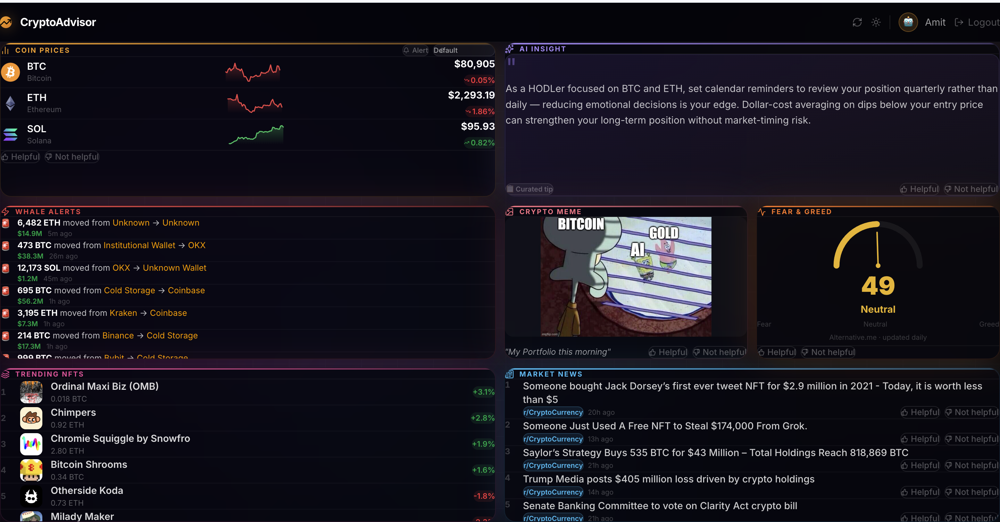
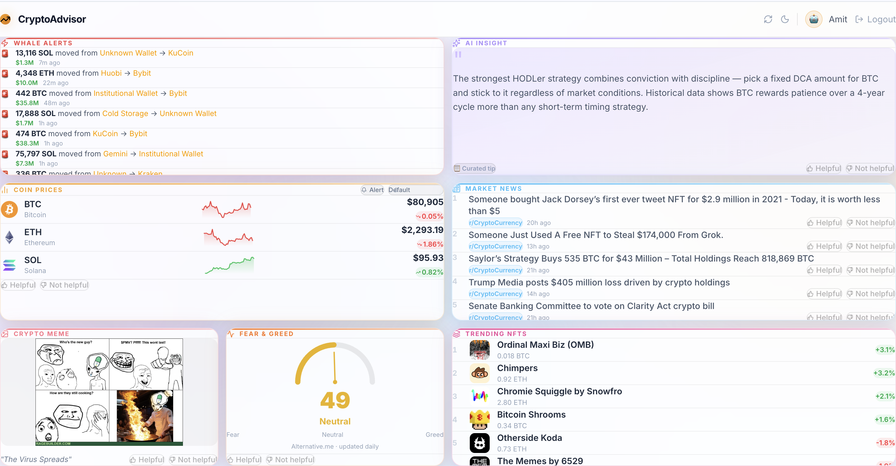
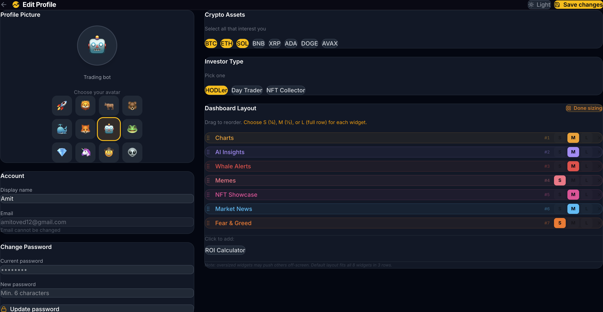
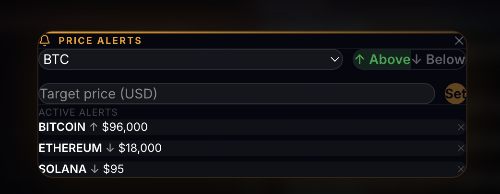
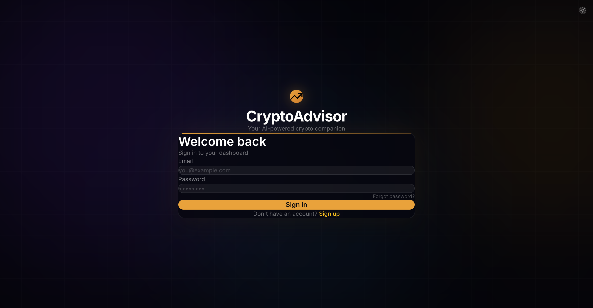
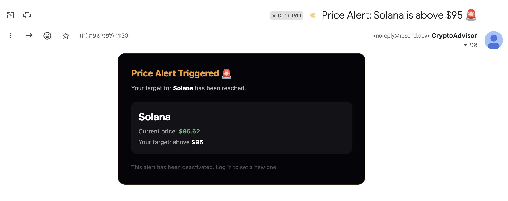

# CryptoAdvisor — AI-Powered Crypto Dashboard

A personalized crypto investor dashboard that learns your preferences and serves daily AI-curated content — live prices, real news, an AI insight, and a fun meme. Built as a full-stack web application for the Moveo coding assignment.

**[Live Demo →](https://crypto-advisor-seven.vercel.app)**

---

## ✨ Features

- **Auth & Security** — Register/login with JWT. Forgot password flow with email reset via Resend.
- **Onboarding** — Short quiz to determine crypto interests, investor type, content preferences, and an avatar emoji.
- **8 Dynamic Widgets** — Rendered in a responsive **Masonry Layout**, updated on every load:
  - 📈 **Coin Prices** — Live data from CoinGecko (price + 24h change)
  - 📰 **Market News** — Real posts from r/CryptoCurrency via Reddit API
  - 🤖 **AI Insight of the Day** — LLM-generated tip (OpenRouter), personalized to your investor type and selected coins
  - 😂 **Fun Crypto Meme** — Random image from r/cryptocurrencymemes
  - 😨 **Fear & Greed Index** — Live market sentiment gauge (Alternative.me API)
  - 🧮 **Interactive ROI Calculator** — Select a coin to dynamically calculate what a $1,000 investment 1 year ago is worth today
  - 🖼️ **Trending NFTs** — Top NFT collections by 24h floor price change
  - 🐳 **Whale Alerts** — Simulated massive on-chain crypto transfers
- **Premium UI/UX** — Glassmorphism cards, animated mesh background, skeleton loaders, and `react-hot-toast` notifications.
- **Dark / Light Mode** — Toggle from any page; preference persisted to `localStorage`; flicker-free via inline `<head>` script.
- **Price Alerts** — Set per-coin price thresholds; `node-cron` checks every 10 min; Resend sends a styled HTML email when triggered.
- **Drag & Drop Customization** — Reorder and resize (S/M/L) dashboard widgets in Profile; order and sizes persisted to the DB.
- **Voting System (RLHF)** — Thumbs up/down on every section. Votes are stored in the DB for future machine learning model improvements.

---

## Screenshots

<table>
  <tr>
    <td align="center"><b>Dark Dashboard</b></td>
    <td align="center"><b>Light Dashboard</b></td>
  </tr>
  <tr>
    <td></td>
    <td></td>
  </tr>
  <tr>
    <td align="center"><b>Profile &amp; Widget Layout</b></td>
    <td align="center"><b>Price Alerts Modal</b></td>
  </tr>
  <tr>
    <td></td>
    <td></td>
  </tr>
  <tr>
    <td align="center"><b>Login Page</b></td>
    <td align="center"><b>Email Alert Notification</b></td>
  </tr>
  <tr>
    <td></td>
    <td></td>
  </tr>
</table>

---

## Tech Stack

| Layer | Technology |
|-------|-----------|
| Frontend | React (Vite) + Tailwind CSS v4 |
| Backend | Node.js + Express v5 |
| Database | PostgreSQL (Neon serverless) |
| Auth | JWT + bcrypt |
| Email | Resend API |
| Deployment | Vercel (frontend) + Render (backend) |

---

## Getting Started

### Prerequisites
- Node.js 18+
- A [Neon](https://neon.tech) PostgreSQL database (free tier)

### Installation

```bash
git clone https://github.com/Am1its/Crypto-advisor.git
cd Crypto-advisor
```

**Backend**
```bash
cd server
cp .env.example .env    # fill in your keys (see below)
npm install
npm run migrate         # creates all tables
npm run dev             # runs on http://localhost:3001
```

**Frontend**
```bash
cd client
npm install
npm run dev             # runs on http://localhost:5173
```

---

## Environment Variables

Create `server/.env` based on `server/.env.example`:

```env
PORT=3001
CLIENT_URL=http://localhost:5173
DATABASE_URL=postgresql://...          # Neon connection string
JWT_SECRET=your_long_random_secret

COINGECKO_API_KEY=                     # free at coingecko.com/developers
OPENROUTER_API_KEY=                    # free at openrouter.ai
RESEND_API_KEY=                        # free at resend.com (optional — shows link on screen if missing)
```

---

## API Endpoints

| Method | Endpoint | Auth | Description |
|--------|----------|------|-------------|
| POST | `/api/auth/register` | — | Register, returns JWT |
| POST | `/api/auth/login` | — | Login, returns JWT |
| POST | `/api/auth/forgot-password` | — | Send password reset email |
| POST | `/api/auth/reset-password` | — | Reset password via token |
| POST | `/api/onboarding` | ✓ | Save user preferences |
| GET  | `/api/dashboard` | ✓ | Fetch all 8 widgets in parallel |
| POST | `/api/votes` | ✓ | Submit thumbs up/down |
| GET  | `/api/profile` | ✓ | Get user + preferences |
| PUT  | `/api/profile` | ✓ | Update name, preferences, widget sizes |
| PUT  | `/api/profile/password` | ✓ | Change password |
| GET  | `/api/alerts` | ✓ | List active price alerts |
| POST | `/api/alerts` | ✓ | Create a price alert |
| DELETE | `/api/alerts/:id` | ✓ | Deactivate a price alert |
| GET  | `/health` | — | Server health check |

---

## Deployment

| Service | Settings |
|---------|----------|
| **Vercel** | Root dir: `client` · Add env var `VITE_API_URL=<your-render-url>` |
| **Render** | Root dir: `server` · Build: `npm install` · Start: `node server.js` · Add all env vars |

---

## Bonus: Feedback Loop & Model Training

The thumbs up/down votes (stored per user, per content item) create a naturally labeled dataset for future model improvements:

1. **Feature engineering** — encode `(user_preferences, content_metadata)` as vectors
2. **Model** — train a ranking model (`P(vote=up | user, content)`) starting with logistic regression, graduating to a neural ranker as data grows
3. **Re-ranking** — surface content each user is most likely to upvote
4. **Retraining** — weekly batch job on Render; deploy only if the new model beats baseline on a held-out set
5. **Cold start** — new users fall back to global popularity until their vote history accumulates

The onboarding quiz provides a strong prior signal before any votes exist — mirroring how Netflix and Spotify bootstrap from explicit preferences before shifting to behavioral signals.

---

For the full interaction log and architecture notes see [`docs/AI_INTERACTIONS.md`](docs/AI_INTERACTIONS.md).